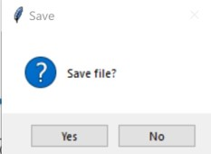

# Spectra
A Graphical Usual Interface (GUI) that is able to read data files and output a Spectra Image with the help of Python software.

Data files are being collected from experiments and have to be read through the code. Once all files are recorded, it outputs a Spectra Image and save the array into a 'dat' file (a generic data file that stores information specific to the application it refers to) when the save button is clicked. In more detail, the spectra image is form by multiple graphs from all files in a single folder that consolidate together and form a wave form as shown below (fig 2.0). The user will be allowed to check each and every output graph from an individual file to locate and record down the local maximum points shown with the help of algorithms, interpolation and smoothing of the graph. The smoothing of curve used is Golay filter. A Savitzky-Golay filter is a digital filter that can be applied to a set of digital data points for the purpose of smoothing the data, that is, to increase the signal-to-noise ratio without greatly distorting the signal. In addition, the user is allowed to remove and add in any local maximum points he wish to have. Similarly, these local points will be saved into a different 'dat' file as an array when
the 'save' button is clicked.

## What does the GUI do? ##
1. The user will need to select the folder that all the data files are stored by clicking the 'browse' button

2. When the "consolidate" button is pressed and an odd number in input under the "window size" entry box, an image will be displayed

3. If the user wish to save the image in an array format, the 'save' button has to be clicked.
    
The file will be save into 'dat' format for the user to see the results

4. When the 'plot' button is pressed, the graph will be plotted according to the first file and the local maximum points will be marked as a red dot.
    
The graphs are smooth and interpolated with the help of algorithms to determine the local maximum point. In addition, the file in which is plotting is being highlighted on the image

5. The 'Next' and 'Previous' button will plot the graph according to the file that the user wish to see

6. When clicking 'save', it saves not only the local maximum points, but also the graph plot as an array.

7.	Mouse events of left and right click will add and remove the local max points to the user's necessity.  
**Example of Addition.**  

| Before        | After         |
| --- | --- |
|  |  |  

**Example of Removing.**  

| Before        | After         |
| --- | --- |
|  |  |

